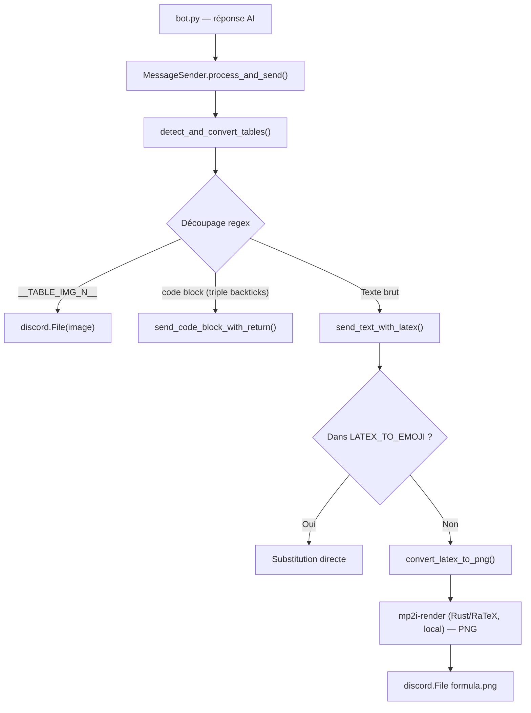
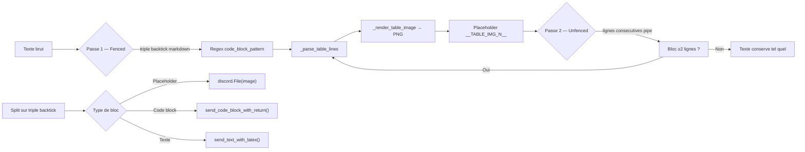
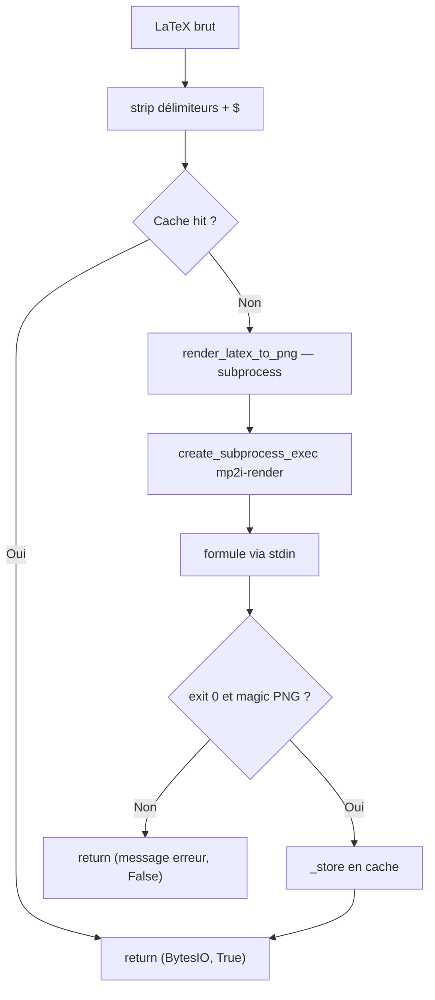
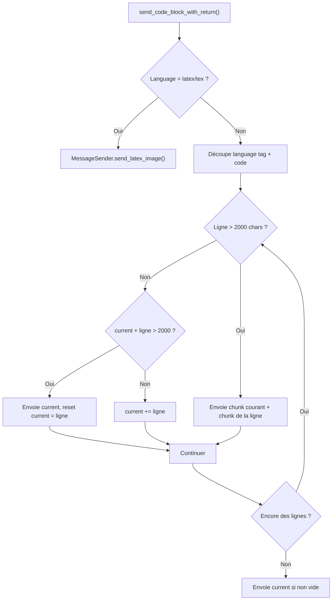

# Handlers

Dossier : `utils/handlers/` · 4 modules, 1 orchestrateur

Pipeline de rendu des réponses AI : texte brut → tables → LaTeX → code blocks → Discord.
Chaque handler traite un format spécifique ; `MessageSender` orchestre le tout.



---

## Fichiers

| Fichier | Rôle |
| :------ | :--- |
| `messages.py` | `MessageSender` — orchestrateur, découpe la réponse et dispatche chaque morceau |
| `table.py` | Détection + rendu image des tables markdown (PIL/Pilmoji) |
| `latex.py` | Détection + rendu PNG des formules LaTeX (binaire local `mp2i-render`, moteur Rust RaTeX) |
| `codeblock.py` | Envoi des blocs de code avec split à 2000 caractères (limite Discord) |

---

## `MessageSender` — orchestrateur

```python
from utils.handlers.messages import MessageSender

sender = MessageSender(channel, bot, max_length=2000, debug=None)
await sender.process_and_send(response: str) → (Message | None, list[dict])
```

### `process_and_send` — pipeline complet

1. **Tables** — `detect_and_convert_tables(response)` détecte les tables fenced
   (`` ```markdown ``) et unfenced (lignes commençant par `|`). Chaque table
   est rendue en image PNG et remplacée par un placeholder `__TABLE_IMG_N__`.
2. **Découpage** — le texte modifié est découpé via regex en 3 types de blocs :
   placeholders de table, code blocks (`` ``` ``), texte brut.
3. **Dispatch** — chaque bloc est envoyé au handler approprié :
   - Placeholder table → `discord.File(image)`
   - Code block → `send_code_block_with_return()`
   - Texte → `send_text_with_latex()` (gère le LaTeX inline dans le texte)

### `send_text_with_latex`

Détecte les formules LaTeX dans le texte via `LATEX_PATTERN.finditer()` (positions
exactes, pas de `str.find()`). Pour chaque match :
- Si dans `LATEX_TO_EMOJI` → substitution directe (ex: `\alpha` → `α`)
- Sinon → rendu image via `convert_latex_to_png()`

### `_clean_latex`

Nettoie les délimiteurs LaTeX dans cet ordre :
1. Code fence ` ```latex ... ``` `
2. Display math `$$...$$` (avant `$...$` pour éviter de ne stripper qu'un `$`)
3. Inline math `$...$`
4. Display bracket `\[...\]`
5. Inline paren `\(...\)`

---

## `table.py` — rendu de tables

```python
from utils.handlers.table import detect_and_convert_tables

new_text, images, table_data = detect_and_convert_tables(text)
# images : list[io.BytesIO]     — PNG rendus
# table_data : list[dict]       — {"id", "headers", "rows", "links"}
```

### `detect_and_convert_tables`



Les placeholders `__TABLE_IMG_N__` sont insérés dans le texte. Les images PNG
sont retournées séparément pour envoi comme `discord.File`.

### Rendu image

- **Fonts** : Noto Sans VF (regular/bold/italic) + IBM Plex Mono (code)
  - Fallback sur polices statiques si les VF ne chargent pas
  - Fallback bitmap (`ImageFont.load_default()`) en dernier recours
- **Inline markdown** : `**bold**`, `*italic*`, `` `code` ``, `__underline__`
  - Les spans code ont un fond coloré (`code_bg`) + padding
  - L'underline est dessiné comme une ligne sous le texte
- **Palette** : dark theme (fond `#070709`, header `#1c1c20`, bordures `#3c3c41`)
- **Emojis** : rendus via Pilmoji (largeur correcte pour les emoji 2 colonnes)
- **Liens** : `[label](url)` → `[N] (domaine)` avec numérotation globale,
  URLs plaines aussi capturées

### Parsing des tables

```python
_parse_table_lines(lines) → (headers, rows, aligns) | None
```

- Alignements détectés depuis la ligne séparateur : `:---` (left), `:---:` (center), `---:` (right)
- Cellules manquantes paddées avec `""`
- ≥2 lignes de pipes requises pour détecter une table

### Constantes

| Constante | Valeur | Description |
| :-------- | :----- | :---------- |
| `FONT_SIZE` | 28 | Taille police body |
| `HEADER_FONT_SIZE` | 32 | Taille police headers |
| `PADDING` | 24 | Padding cellules (px) |
| `HEADER_HEIGHT` | 80 | Hauteur header (px) |
| `MIN_ROW_HEIGHT` | 60 | Hauteur minimale ligne (px) |
| `COLUMN_MAX_WIDTH` | 1200 | Largeur max colonne (px) |
| `LINE_HEIGHT_RATIO` | 1.35 | Rapport interligne |

---

## `latex.py` — rendu LaTeX

```python
from utils.handlers.latex import convert_latex_to_png, detect_latex, LATEX_PATTERN

matches = detect_latex(text)  # list[str]
result, ok = await convert_latex_to_png(latex)  # (BytesIO | str, bool)
```

### `LATEX_PATTERN` — détection

Capture 5 formats (par ordre de priorité) :
1. `` ```latex ... ``` `` — bloc fenced
2. `$$...$$` — display math
3. `\[...\]` — display bracket
4. `\(...\)` — inline paren
5. `$...$` — inline dollar (≥1 caractère entre les `$`)

### `convert_latex_to_png`



Retourne `(BytesIO, True)` en cas de succès, `(str, False)` en cas d'erreur
(message d'erreur formaté pour Discord).

### Renderer local (Rust / RaTeX)

```python
RENDERER_BIN = os.getenv("LATEX_RENDERER_BIN", "<repo>/renderer/target/release/mp2i-render")
RENDERER_SCALE = float(os.getenv("LATEX_RENDERER_SCALE", "2"))
```

- `render_latex_to_png()` : sous-processus `mp2i-render --scale N`, formule sur
  stdin, PNG sur stdout (fond transparent, texte blanc, style display).
- Aucun appel réseau : plus de serveur distant ni de cairosvg.
- Binaire : compilation locale avec `mise run renderer` (`cargo build
  --release`), ou téléchargement du prébuilt via `mise run renderer-install`
  (`.github/workflows/rust.yml` build, package et publie le binaire en
  artifact + GitHub Release sur tag `v*`).
- Timeout 10s ; sortie non-zéro ou mauvais magic PNG → `(None, erreur)`.

### `LATEX_TO_EMOJI` — substitution directe

48 symboles courants : grec minuscule/majuscule (α β γ … Ω), opérateurs
(∑ ∏ ∫), relations (≠ ≤ ≥ ≈), artefacts (× ÷ ∞). Pas de requête réseau
pour ces symboles.

### Cache

```python
_LATEX_CACHE: dict[str, io.BytesIO] = {}  # cleaned latex → PNG
_LATEX_CACHE_MAX = 128
```

- Clé : `latex.strip()` (normalisé)
- Éviction : supprime la plus ancienne entrée quand max atteint
- Thread-safe en pratique (CPython GIL), mais pas de verrou explicite

### Renderer local vs réseau

L'ancienne implémentation appelait `math.vercel.app` (SVG) puis convertissait
via cairosvg, avec throttle 0.4s et headers browser-like pour éviter le rate
limit. Tout cela a été supprimé : le rendu est désormais 100% local via le
binaire Rust `mp2i-render` (stdin → PNG stdout), donc plus de latence réseau,
plus de throttle, plus de dépendance à cairosvg.

---

## `codeblock.py` — blocs de code

```python
from utils.handlers.codeblock import send_code_block_with_return

await send_code_block_with_return(channel, code_block, max_length=2000, bot=None)
```

### Comportement



### Exemple de split

```
Message 1: ```python\nline_1\nline_2\n...```
Message 2: ```python\nline_N\n...```
```

---

## Limites connues

- **Tables unfenced dans des code blocks** : la 2e passe de
  `detect_and_convert_tables` pourrait convertir du code affiché comme texte
  s'il commence par `|`.
- **Word-wrap inline markdown** : `_wrap_segments` coupe sur les espaces, pas
  sur les balises markdown. Un `**mot longmot**` pourrait être coupé en plein
  milieu du gras.
- **`subprocess` async** dans `render_latex_to_png` : `create_subprocess_exec`
  non bloquant, sous-processus court (quelques ms) → pas de blocage de l'event
  loop.
