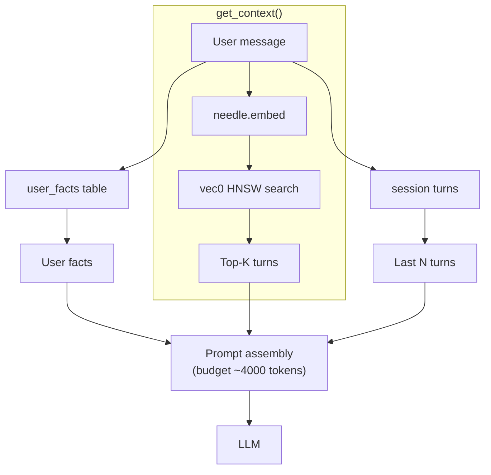
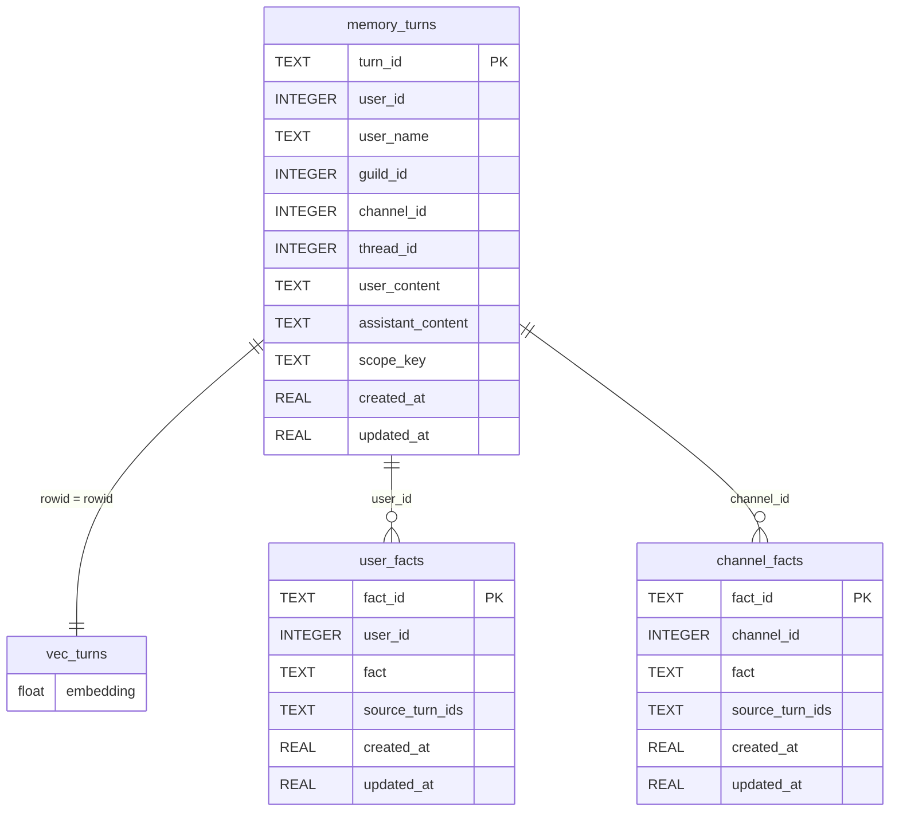
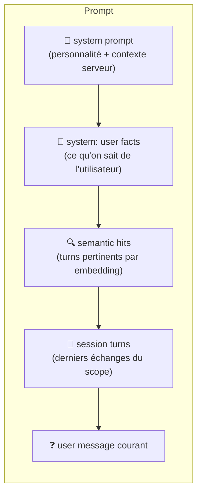
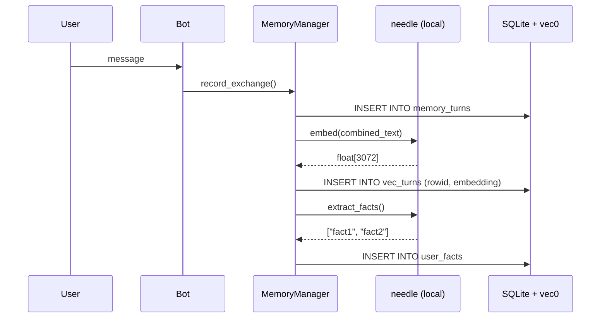
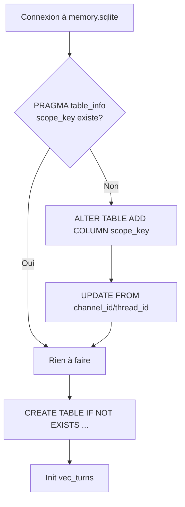

# Memory system

Fichier : `managers/memory.py` · Schéma : `db/sql/memory_schema.sql`

DB : **`data/memory.sqlite`** (gitignorée, création auto). Mémoire conversationnelle
du bot, persistée en SQLite avec recherche sémantique via **sqlite-vec** et
embeddings **needle** (cactus-needle v3, 3072 dimensions).

## Architecture



Quatre couches de mémoire, de plus en plus persistantes :

| Couche | Scope | Stockage | Contenu |
|--------|-------|----------|---------|
| **L1 Session** | channel/thread | SQLite (last N) | Derniers 15 échanges |
| **L2 User Facts** | user_id | SQLite `user_facts` | Faits extraits par needle |
| **L3 Channel Facts** | channel_id | SQLite `channel_facts` | Résumé du canal |
| **L4 Full History** | tous | SQLite + vec0 | Tous les échanges, embeddings inclus |

## Schema SQL

### Diagramme ER



### `memory_turns`

```sql
CREATE TABLE memory_turns (
    turn_id TEXT PRIMARY KEY,
    user_id INTEGER NOT NULL,
    user_name TEXT NOT NULL,
    guild_id INTEGER,
    channel_id INTEGER,
    thread_id INTEGER,
    user_content TEXT NOT NULL,
    assistant_content TEXT,
    scope_key TEXT NOT NULL,     -- "channel:ID" ou "thread:ID"
    created_at REAL NOT NULL,
    updated_at REAL NOT NULL
);
```

`scope_key` est calculé par `make_scope_key()` :
- `channel:<id>` pour les salons normaux
- `thread:<id>` pour les threads

### `vec_turns` (virtual table sqlite-vec)

```sql
CREATE VIRTUAL TABLE vec_turns USING vec0(
    embedding float[3072]
);
```

Index HNSW pour la recherche par similarité cosinus. Le `rowid` correspond
au `rowid` de la ligne `memory_turns` correspondante.

### `user_facts`

```sql
CREATE TABLE user_facts (
    fact_id TEXT PRIMARY KEY,
    user_id INTEGER NOT NULL,
    fact TEXT NOT NULL,
    source_turn_ids TEXT,         -- JSON array de turn_ids
    created_at REAL NOT NULL,
    updated_at REAL NOT NULL
);
```

Faits persistants extraits automatiquement par needle lors de chaque échange.
Permettent au bot de se souvenir de l'utilisateur **entre les sessions**.

### `channel_facts`

```sql
CREATE TABLE channel_facts (
    fact_id TEXT PRIMARY KEY,
    channel_id INTEGER NOT NULL,
    fact TEXT NOT NULL,
    source_turn_ids TEXT,
    created_at REAL NOT NULL,
    updated_at REAL NOT NULL
);
```

## API

```python
from managers.memory import MemoryManager, make_scope_key

memory = MemoryManager(max_history=15)

# --- CRUD ---
turn_id = memory.record_exchange(
    user_id=123,
    user_name="Alice",
    user_content="...",
    assistant_content="...",
    guild_id=1,
    channel_id=100,
)

turn = memory.get_turn(turn_id)  # exact ou prefix
turns = memory.list_turns(scope_key, limit=10)
memory.delete_turn(turn_id)
memory.clear_history(scope_key)  # supprime tout un scope

# --- Contexte pour le LLM ---
history = memory.get_history(scope_key, limit=15)  # legacy, last N
context = memory.get_context(  # intelligent
    scope_key,
    user_id=123,
    current_query="comment dériver ?",
)

# --- User facts ---
memory.add_user_fact(user_id, "Alice préfère les maths")
facts = memory.get_user_facts(user_id)
memory.clear_user_facts(user_id)

# --- Async wrappers (utilisés par bot.py) ---
await memory.record_and_sync(...)
await memory.delete_turn_and_sync(turn_id)
await memory.clear_history_and_sync(scope_key)
await memory.sync()
await memory.bootstrap()
```

## get_context() en détail

Sélectionne le contexte pertinent pour le LLM en 3 étapes :

1. **User facts** : récupère les faits persistants pour `user_id` (max 10)
   et les injecte comme message system
2. **Recherche sémantique** : `needle.embed(current_query)` → `vec0 MATCH`
   → top-5 turns les plus similaires (fallback keyword LIKE si < 3 résultats)
3. **Session turns** : les `max_history` derniers tours du scope, en excluant
   ceux déjà trouvés par les étapes 1-2

L'ordre d'injection dans le prompt :



## Embeddings



- **Modèle** : needle v3 (`cactus-needle`, ~14MB, local)
- **Dimension** : 3072 floats
- **Stockage** : `struct.pack()` en BLOB dans `vec_turns`
- **Génération** : à chaque `record_exchange()` sur le texte combiné
  `"{user_name}: {user_content}\n{assistant_content}"`
- **Backfill** : `bootstrap()` génère les embeddings pour les turns existants
  qui n'en ont pas

Performance mesurée :
| Opération | Temps (500 vecteurs) |
|-----------|---------------------|
| Insertion | ~14ms |
| Recherche HNSW | ~2.9ms |
| Brute-force Python | ~83ms (28x plus lent) |

## Migration

Le schema gère automatiquement la migration depuis l'ancienne version (sans
`scope_key`) :



## Commandes Discord

| Commande | Description | Fichier |
|----------|-------------|---------|
| `/memory-list [limit] [user]` | Affiche les échanges récents | `cmds/memory_list.py` |
| `/memory-delete <turn_id>` | Supprime un échange | `cmds/memory_delete.py` |
| `/memory-clear` | Efface tout le scope (admin) | `cmds/memory_clear.py` |

## Fichiers

| Fichier | Rôle |
|---------|------|
| `managers/memory.py` | MemoryManager, embeddings, recherche |
| `db/sql/memory_schema.sql` | Schema DDL |
| `db/sql/memory_*.sql` | Requêtes CRUD |
| `cmds/_memory.py` | Helper scope pour les commandes |
| `data/memory.sqlite` | DB (gitignorée) |

## Dépendances

| Package | Rôle |
|---------|------|
| `sqlite-vec` | Extension SQLite pour la recherche vectorielle HNSW |
| `cactus-needle` | Embeddings 3072-dim + extraction de faits |
