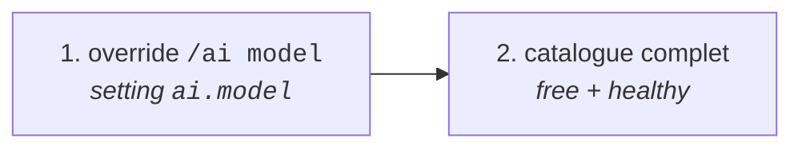

# Sélection des modèles

Fichier : `core/ai/models.py` · Config : `config/ai_config.json5` · Commande : `/ai model`

Le modèle par défaut n'est plus écrit en dur : il est choisi dans le catalogue que
publie l'endpoint (`GET https://gen.pollinations.ai/v1/models`) — **accès libre
(règle officielle `access:free`) et santé `healthy` ou `reliable` (> 80 % de
succès)**. Il n'y a **plus aucune liste de modèles statique** : `ai_config.json5`
ne porte plus que `api_url`, `tools`, `streaming`, `memory_max_history`… et
`/ai model` gagne sur tout le reste.

## Pourquoi

Avant, la liste était statique dans `ai_config.json5` : rien ne vérifiait qu'un
modèle était gratuit, disponible, ou même encore servi par l'endpoint. Le
premier critère utilisé ici — `pricing` sans valeur chiffrée — était faux :
**un modèle payant peut n'avoir aucun prix propre**, parce qu'il facture ce que
délègue le modèle auquel il se route (`polli`, `floret`, `frugal`,
`tiered-health-router`, `triage-router`, `polyrouter`, `osaii-swarm`,
`agentic-gt`, `pollinations-code-agent-but-weird` : neuf modèles filtrés à tort
jusqu'ici).

La règle retenue est **exactement celle du dashboard**
(`enter.pollinations.ai/models?q=...access:free`), recopiée de son bundle
(`assets/model-catalog-*.js`).

| Champ | Signification |
|-------|---------------|
| `pricing` | prix par token en `pollen`. Somme des `prompt*` + `completion*` ; une valeur `> 0` signifie payant. Un modèle gratuit n'a que `{"currency": "pollen"}` (aucun prix chiffré, aucun modèle du catalogue n'a de prix strictement `0`) |
| `agent` | `true` pour un modèle **agentic/router** : il appelle d'autres modèles, sa facture n'est donc jamais la sienne |
| `paid_only` / `pricing_adjustments` | forcing payant explicite (jamais présent sur ce catalogue, mais la règle les couvre) |
| `health.status` | `healthy` / `degraded` / `down` / `unknown`, avec `success_rate` et `requests` en complément |


## Le catalogue

```
GET {AI_API_URL}/models          →  {"object": "model", "data": [...]}
                                     AI_API_URL = https://gen.pollinations.ai/v1
```

~300 entrées, dont certaines ne sont pas des modèles de texte (image, audio,
vidéo, embeddings, realtime). Cascades de filtres observées :

```
tous                              ~300
  + access:free (règle officielle)   7-8
  + healthy ou reliable (> 80 %)     2-7
  + category == "text" + chat        2-7   ← catalogue retenu
```

> **Le vivant bouge.** En l'espace d'une heure, le même jeu de filtres a donné
> 7, puis 3, puis 2 modèles éligibles : les modèles communautés passent
> régulièrement de gratuit à payant, et `health` est une fenêtre glissante de
> ~50 requêtes. Le catalogue est donc relu toutes les 300 s, et le dernier état
> connu est conservé quand l'endpoint répond mal.
>
> La requête sans paramètre suffit : les modèles `free + healthy + chat`
> absents de `?reliability=all` sont au nombre de **0**. Le dashboard, lui,
> appelle `{genBaseUrl}/models?reliability=all` (516 entrées) parce qu'il doit
> afficher aussi les modèles indisponibles.

## Filtres (`is_free`, `is_healthy`, `is_chat`)

| Filtre | Règle | Écarte |
|--------|-------|--------|
| `is_free(model)` | `!agent && !paid_only && pricing défini && somme des prix d'entrée == 0 && somme des prix de sortie == 0 && aucun pricing_adjustments > 0` | agents/routers (prix non attribuable), tout modèle facturé |
| `is_healthy(model)` | `health.status == "healthy"` **ou** `success_rate > 80` (seuil `RELIABLE_THRESHOLD`, le `status:reliable` du dashboard) | `degraded` sous 80 %, `down`, `unknown` |
| `is_chat(model)` | `category == "text"` **et** `/v1/chat/completions` dans `supported_endpoints` | image, audio, vidéo, embedding, 3d, realtime |


## Ordre (`select()`)

Les modèles retenus sont triés du plus fiable au moins fiable :

1. `tools: true` d'abord — le bot fait de l'appel d'outils (`image_ocr`, `safe_eval_math`, `search`)
2. `health.success_rate` décroissant
3. `health.requests` décroissant (un modèle à 100 % sur 1 requête est moins probant que sur 10 000)
4. `id` croissant, pour un ordre déterministe

> Exemple relevé le 28/09/2026 : `community/YoannDev90/muse-glimmer-30b:free`
> (seul `tools: true` éligible) ou, quelques minutes plus tôt,
> `community/ZapGaming/llama3.1-8b-xturbo` : la tête de liste suit le `health`
> du moment, pas une liste figée.

## Le dashboard, source de vérité

`https://enter.pollinations.ai/models?q=source:community+status:all+access:free`
est une SPA (Vite) : la logique est dans `assets/model-catalog-*.js` (normalisation
du catalogue) et `assets/model-filter-tokens-*.js` (parseur des tokens du champ
`q`).

Le paramètre `q` est décomposé **côté client** en tokens `clé:valeur` — clés
autorisées : `access`, `source`, `status`, `publisher`, `id`, `type`,
`capability` (les mots restants servent de recherche plein texte). S'ils sont
absents, `source:official` et `status:all` sont injectés.

| Token | Valeurs | Test appliqué au modèle |
|-------|---------|--------------------------|
| `access` | `free` / `paid` / `quest` | `free` → le drapeau `free` ci-dessus ; `paid` → `paid_only === true` ; sinon `quest` (essai via quêtes) |
| `source` | `official` / `community` | `community === true` |
| `status` | `all` / `reliable` / `healthy` | `all` → vrai ; `reliable` → `community && !agent && (success_rate \|\| null) > 80` ; `healthy` → `health.status === "healthy"` |

Côté données, le dashboard fetch `{genBaseUrl}/models?reliability=all`
(`no-store`, timeout 15 s, cache navigateur 60 s).

## Ordre de priorité réel (`priority()`)



- doublons retirés, liste tronquée à `MAX_MODELS = 6`
- **plus de secours statique** : `ai_config.json5` ne contient plus de `models`,
  la rotation est entièrement pilotée par le catalogue (et par l'override)
- dernier catalogue connu conservé quand un refresh échoue ; **aucun catalogue**
  (endpoint injoignable au démarrage) → `generate_answer` répond l'erreur
  `no_models` (`core/ai/client.py:205`)
- l'appelant (`generate_answer`, l'extraction de faits) essaie les modèles **dans
  cet ordre** jusqu'à obtenir une réponse : un modèle en échec passe la main

## Rafraîchissement

| Moment | Déclencheur |
|--------|-------------|
| Démarrage | `setup_hook` → `asyncio.gather(memory.bootstrap(), mcp_manager.initialize(), refresh())` |
| Toutes les **300 s** | `MP2IBot.models_task` (`tasks.loop(seconds=REFRESH_INTERVAL)`) |

- timeout de requête : **15 s**, verrou anti-course (`asyncio.Lock`) + cache TTL
- **échec réseau** : on garde le dernier catalogue connu (aucun modèle perdu)
- **réponse sans modèle éligible** : on garde aussi le catalogue précédent, avec un
  avertissement en log
- `cfg.AI_MODEL` est mis à jour sur chaque refresh réussi, sauf si un override
  `/ai model` existe

## Circuit breaker

Une réponse `400 BAD_REQUEST` d'un modèle ouvre un breaker en mémoire
(`models.note_failure`) : le modèle est retiré de `priority()` / `select()`
pendant `CIRCUIT_TTL` (15 min), puis réintégré automatiquement. Seul le
status 400 déclenche l'exclusion (429, timeouts et 5xx suivent la rotation
classique). Si tous les modèles sont sous breaker, `priority()` retombe sur
la liste complète plutôt que de répondre `no_models`. État en mémoire :
reset à chaque redémarrage.

## `/ai model` : le choix manuel

```
/ai model <id>    →  cfg.AI_MODEL = <id>  +  set_setting("ai.model", <id>)
```

- persisté dans **`data/bot_state.db`** (table `settings`, clé `ai.model`),
  survit au redémarrage et **prime sur le catalogue** (`default_model()`,
  `priority()`)
- pour revenir au choix automatique :

```sql
sqlite3 data/bot_state.db "DELETE FROM settings WHERE key = 'ai.model';"
```

## Où c'est utilisé

| Fichier | Usage |
|---------|-------|
| `core/ai/client.py` `_model_priority()` | rotation des modèles de `generate_answer()` (chat + outils) |
| `managers/memory.py` `_models_priority()` | rotation pour l'extraction de faits (même ordre) |
| `bot.py` | `refresh()` au démarrage + `models_task` périodique |

## Limites

- le catalogue est lu **une fois par intervalle** : un modèle qui dégrade entre
  deux refresh reste dans la rotation jusqu'au prochain
- l'endpoint est parfois indisponible (requêtes répétées observées en échec) :
  on garde alors le dernier catalogue connu, sinon `no_models`
- `/ai model` propose une autocomplétion : modèle actif en premier, puis
  catalogue free+healthy (hors breaker) et fallbacks configurés, filtré sur
  la saisie (25 propositions max) — plus besoin de copier l'id du catalogue
